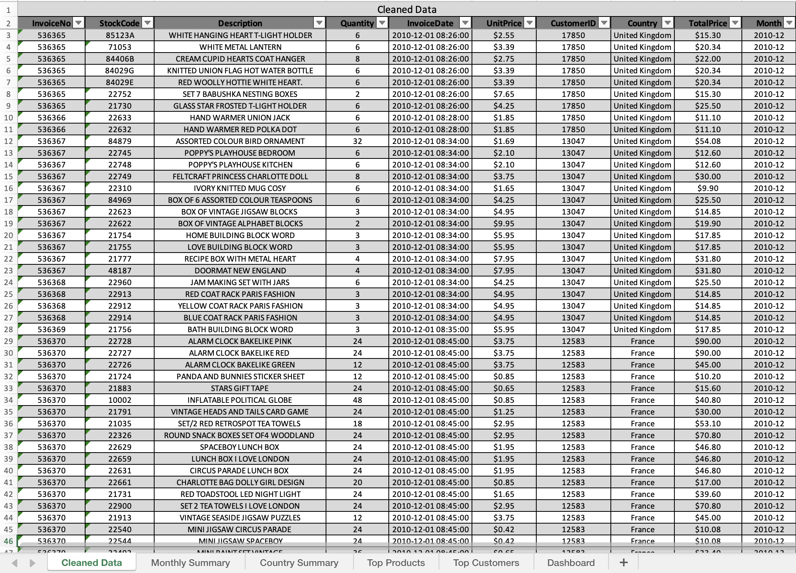
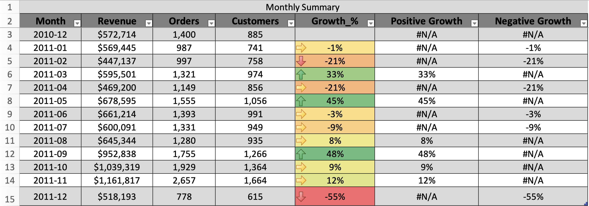
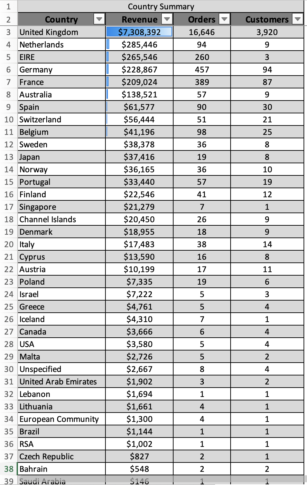
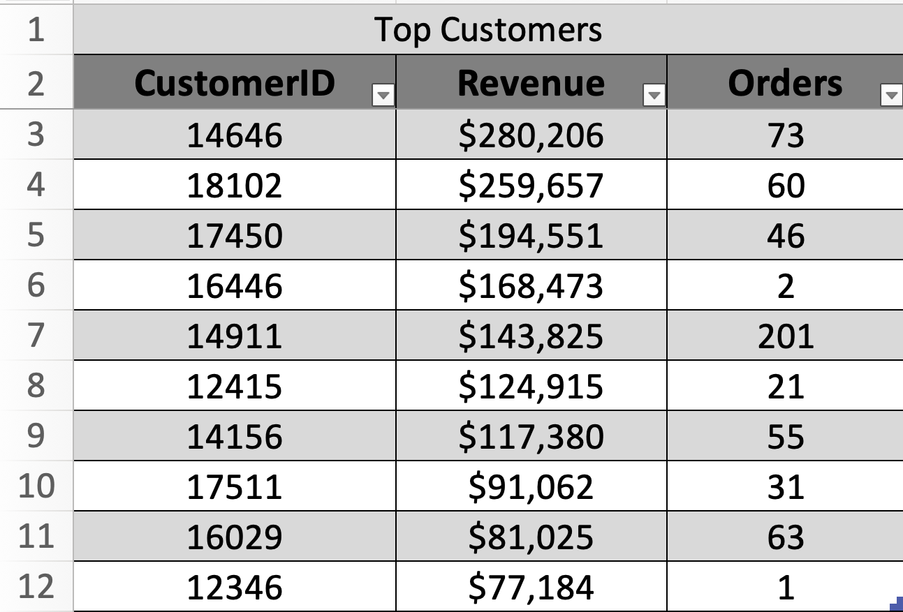
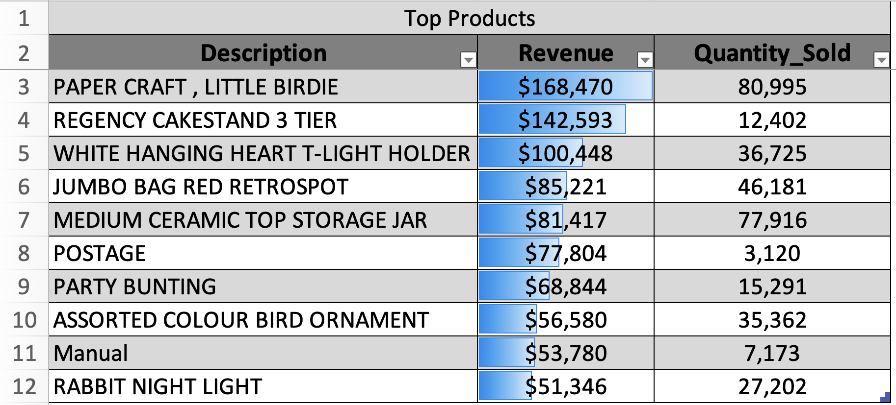
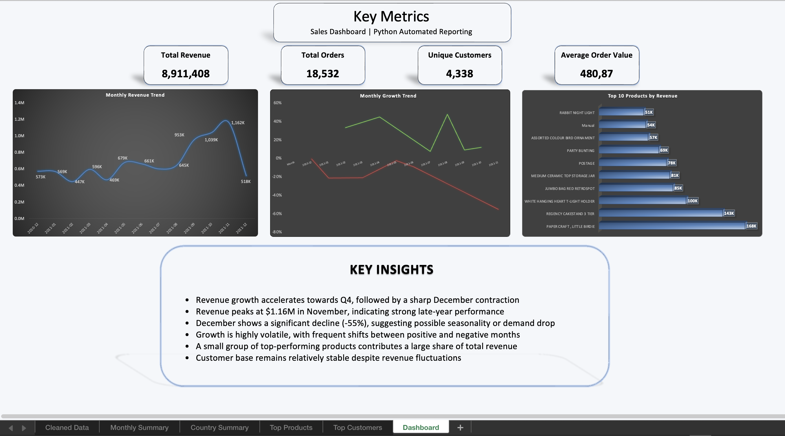

# 📊 Python Data Analysis & Excel Dashboard – Online Retail

This project demonstrates an end-to-end data analysis workflow using Python, transforming raw retail data into a clean dataset and generating an automated Excel dashboard.

---

## 🎯 Project Objective
The goal of this project is to automate data cleaning, analysis, and reporting to generate business insights and visual dashboards.

---

## 🔄 Workflow Overview
1. Load raw dataset  
2. Clean and preprocess data  
3. Create new features (Revenue, Month)  
4. Aggregate data for analysis  
5. Export results to Excel  
6. Build dashboard for visualization  

---

## 🧹 Data Cleaning
- Removed missing and invalid records  
- Filtered negative values (Quantity, Price)  
- Converted data types  

---

## 📅 Monthly Performance Analysis
- Revenue trends over time  
- Growth % calculation  

---

## 🌍 Country Analysis
- Revenue and orders by country  
- Identified top markets  

---

## 👥 Customer Analysis
- Top customers by revenue  
- Purchase behavior insights  

---

## 🛍️ Product Analysis
- Top-selling products by revenue  
- Key contributors to sales  

---

## 📊 Final Dashboard
- KPIs: Total Revenue, Orders, Customers, Avg Order Value  
- Revenue trend visualization  
- Product performance chart  

---

## 🛠️ Tools & Technologies
- Python (pandas)  
- Excel  
- Data Analysis & Automation  

---

## 📈 Key Insights
- Revenue shows strong growth toward year-end  
- Sales peak in Q4, indicating seasonality  
- A small number of products and customers drive most revenue  
- Monthly growth is volatile with both positive and negative periods  

---

## 📎 Files Included
- `retail_report.py` → Python automation script  
